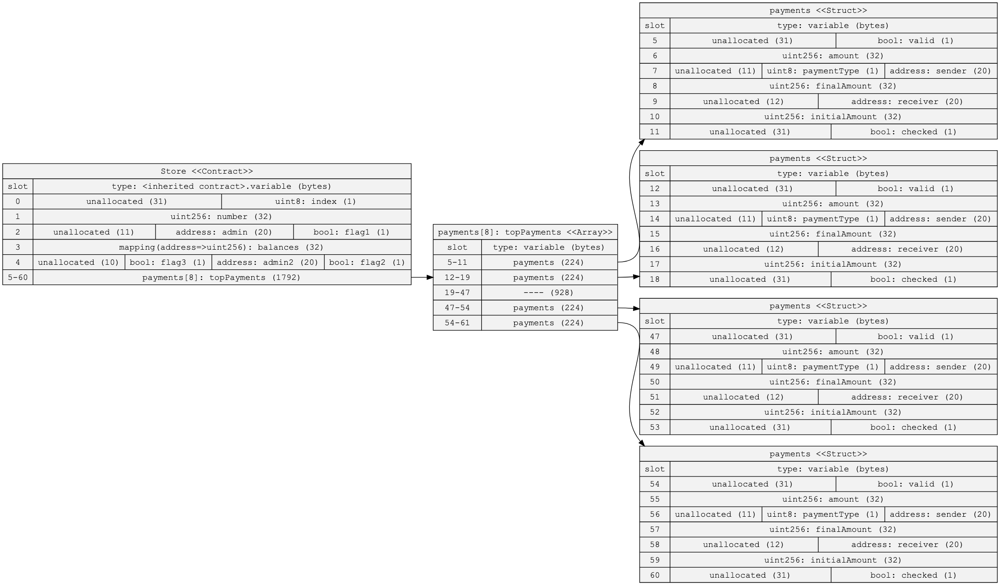
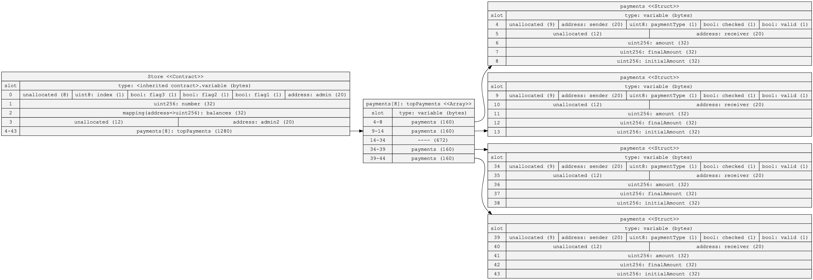

# HomeWork4

This is a simple repos to complete the HomeWork4 of the [Encode Club Expert Solidity Bootcamp](https://www.encode.club/expert-solidity-bootcamp).
You can find the instruction in the PDF file [here](../Homework4.pdf).


## Optimising Storage
 
### By re ordering the variables, can you reduce the of storage slots needed ?

The original Sol2UML of the contract (contract link : [Store_original_version.sol](./Store_original_version.sol) : 



The optimized version Sol2UML of the contract (contract link : [Store_original_optimized.sol](./Store_original_optimized.sol) : 




## Foundry Introduction

### Try out the Solidity Template of Foundry Template

#### Start a new project

- Hardhat Template project link : [here](https://github.com/NelsonRodMar/hardhat-template-for-encodeclub) 

- Foundry Template project link : [here](https://github.com/NelsonRodMar/foundry-template-for-encodeclub-) 


#### Make a fork of mainnet from the command line (you may need to setup an Infura or Alchemy account)

```shell
$ forge test --fork-url <your_rpc_url>
```

See documentation [here](https://book.getfoundry.sh/forge/fork-testing) to know more.


#### Query the mainnet using the command line to retrieve a property such as latest block number.

```shell
$  cast block-number --rpc-url  <your_rpc_url>
In Practice : 
$  cast block-number --rpc-url https://rpc.mevblocker.io
```

See documentation [here](https://book.getfoundry.sh/reference/cast/cast-block-number#cast-block-number) to know more.


#### Is it valid Solidity ?

From the [documentation](https://docs.soliditylang.org/en/v0.8.11/types.html#function-types) and 
[forum](https://ethereum.stackexchange.com/questions/117725/passing-functions-as-parameters-how-to-invoke) or [here](https://ethereum.stackexchange.com/questions/3342/pass-a-function-as-a-parameter-in-solidity) it's possible to pass a function as argument of function, it's called function types and the specific snippet of code looks of because it compile [cf.](./valid-solidity) forge repository.

