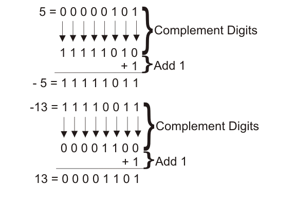

**1. Why are negative numbers more expensive to store than positive numbers ?**

Because to store a negative number we take the same bit than for the positive number and we add 1.
Example :


More info or src :
- https://www.rareskills.io/post/signed-int-solidity
- https://blog.devgenius.io/how-integers-are-stored-in-memory-using-twos-complement-9131880ae9b3 (article for C language but look the same way for storage)


**2) Test the following statements in Remix, which is cheaper and why? Assume that the denominator can never be zero.**

Statement 1 :
```solidity
result = numerator / denominator;
```

Statement 2 :
```solidty 
assembly {
	result := div(numerator, denominator)
}
```

The second is the cheapest one because in the first Solidity do checked to avoid overflow or underflow where as in the second in assembly we don't do this checked.


